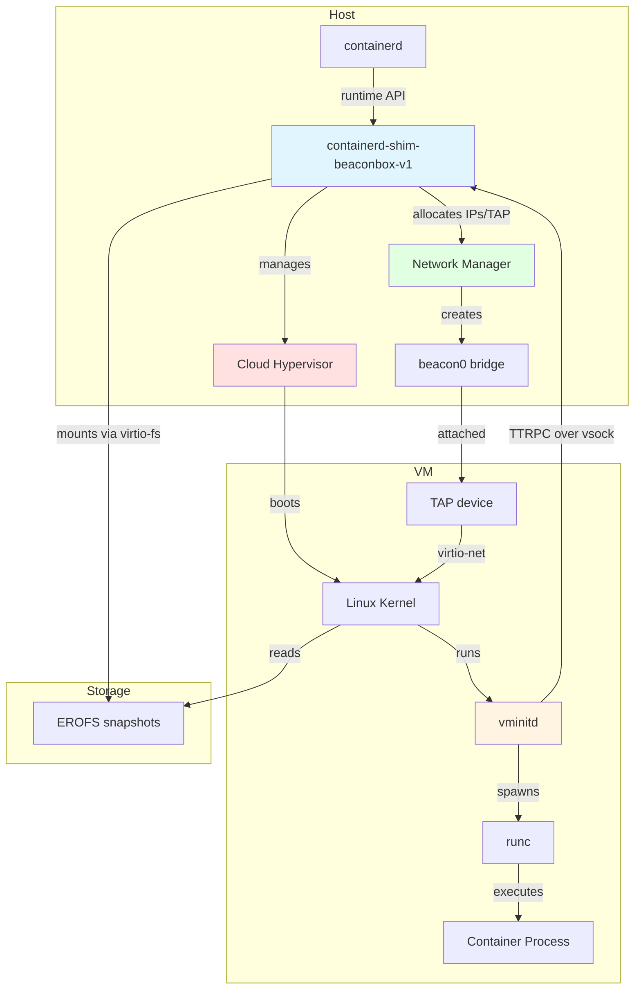
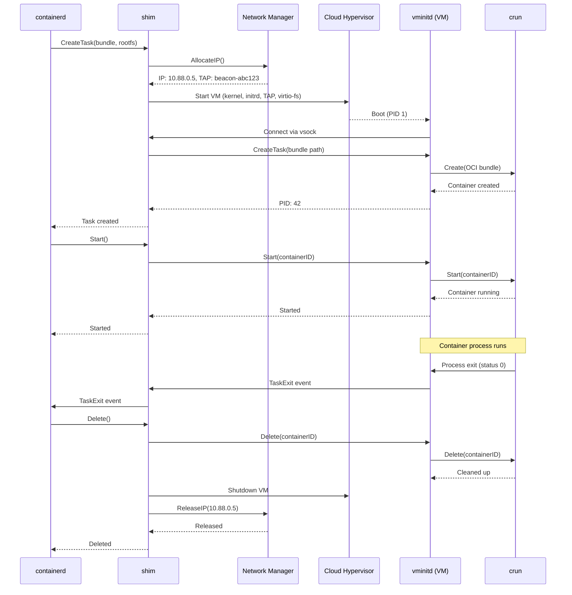

# beaconbox: containerd runtime shim with VM isolation

___(Experimental)___ beaconbox (contaiNERD sandBOX) is a containerd runtime shim which
isolates container processes using lightweight virtual machines. It is designed for running
Linux containers with enhanced security and isolation.

 - **Linux only** - Requires Linux host with KVM support
 - Works with containerd running on native host
 - EROFS support for efficient container image layers
 - One VM per container for maximum isolation
 - Simplified architecture using Cloud Hypervisor
 - Integrated network management with TAP/bridge networking

beaconbox is a **non-core** sub-project of containerd.

## Architecture



### How it works

1. **Container Creation**: When containerd creates a container with the beaconbox runtime, it spawns the `containerd-shim-beaconbox-v1` shim process
2. **VM Setup**: The shim creates a Cloud Hypervisor VM instance with:
   - Linux kernel and initrd (containing vminitd)
   - EROFS container image layers mounted via virtio-fs
   - TAP network device connected to the beacon0 bridge
3. **Network Allocation**: The network manager allocates an IP address from the 10.88.0.0/16 subnet and creates a TAP device
4. **VM Boot**: Cloud Hypervisor boots the Linux kernel with the allocated network configuration
5. **Container Execution**: Inside the VM, vminitd communicates with the shim via vsock and uses crun (OCI runtime) to execute the container process
6. **I/O & Events**: Container stdio and lifecycle events flow through vsock between vminitd and the shim

### Component Details

#### Host Components

**containerd-shim-beaconbox-v1**
- Implements containerd's runtime shim API
- Manages Cloud Hypervisor VM lifecycle (create, start, stop, delete)
- Handles network setup via integrated network manager
- Proxies container I/O between containerd and VM (via vsock)
- Coordinates with vminitd inside VM using TTRPC protocol

**Network Manager**
- Manages the `beacon0` bridge (10.88.0.0/16 subnet)
- Allocates unique IP addresses from pool using persistent key-value store
- Creates TAP devices for each VM (named `beacon-<hash>`)
- Configures nftables rules for NAT and forwarding
- Automatically reconciles and cleans up stale resources

**Cloud Hypervisor**
- Lightweight KVM-based virtual machine monitor
- Boots Linux kernel with minimal memory footprint
- Provides virtio devices: virtio-net (TAP), virtio-fs (storage), vsock (communication)
- Runs as subprocess managed by the shim

#### VM Components

**vminitd**
- Init daemon (PID 1) running inside the VM
- Implements containerd's Task API via TTRPC over vsock
- Manages container lifecycle using crun (OCI runtime)
- Handles stdio forwarding between crun and shim
- Process reaper for container exit status collection
- Supports exec, pause/resume, and checkpoint/restore operations

**crun**
- Standard OCI runtime (lightweight alternative to runc)
- **Primary role**: Enforces cgroups v2 resource limits within the VM
- Creates process namespaces (PID, mount, IPC, UTS) - network namespace explicitly removed
- Sets process UID/GID and drops Linux capabilities
- Exits after container starts (minimal runtime overhead)
- **Resource enforcement**: VM has fixed 2 vCPU + 4GB; crun applies container-specific limits within those bounds

**Linux Kernel**
- Minimal kernel with virtio drivers and cgroups v2 support
- Mounts container rootfs from virtio-fs shares
- Network configured via kernel command line parameters
- Provides process isolation and resource management

#### Storage Layer

**EROFS Snapshots**
- Read-only filesystem optimized for container images
- Image layers mounted on host and shared to VM via virtio-fs
- Eliminates need for image unpacking inside VM
- Supports efficient layer sharing across containers

**virtio-fs**
- High-performance filesystem sharing between host and VM
- DAX (Direct Access) mode for minimal overhead
- Shared memory region for fast I/O
- Read-only mounts for security

#### Communication

**vsock (virtio-socket)**
- Socket communication between host and VM
- Uses CID (Context ID) addressing instead of IP
- TTRPC protocol for structured RPC calls
- Multiplexed for both control plane (API) and data plane (stdio)

### Design Decisions

**Why Cloud Hypervisor?**
- Lightweight VMM optimized for cloud workloads
- Faster than QEMU for microVM use cases
- Strong virtio device support (virtio-fs, vsock, virtio-net)
- Active development and KVM expertise
- Simpler codebase than alternatives

**Why crun inside the VM?**
- **Resource limits**: Enforces memory/CPU limits via cgroups v2 within the VM
- **Process isolation**: Creates additional namespace layers (PID, mount, IPC, UTS)
- **OCI compatibility**: Maintains standard OCI spec contract with containerd
- **User credentials**: Sets process UID/GID and drops capabilities per spec
- Minimal overhead (~1.5MB binary, exits after container start)
- Note: VM provides primary isolation; crun adds resource accounting and fine-grained limits

**Why EROFS?**
- Read-only filesystem eliminates security concerns
- Compressed images reduce storage and I/O
- Direct mounting via virtio-fs (no unpacking needed)
- Excellent random access performance
- Native Linux kernel support

**Why vsock?**
- Purpose-built for host-VM communication
- No network stack overhead
- Automatic connection on VM boot
- Secure by design (isolated from network)
- Low latency for RPC and stdio streaming

**Why TAP/bridge networking?**
- Standard Linux networking model
- Compatible with existing CNI plugins
- Simple IP allocation and routing
- Full protocol support (TCP, UDP, ICMP, IPv6)
- Easy integration with host firewall rules

### Network Architecture

The network manager creates a single `beacon0` bridge that all VMs connect to:

```
Internet
    ↓
Host network interface
    ↓
nftables NAT (beacon_runner_nat)
    ↓
beacon0 bridge (10.88.0.1/16)
    ├─ beacon-abc123 (TAP) → VM 1 (10.88.0.2)
    ├─ beacon-def456 (TAP) → VM 2 (10.88.0.3)
    └─ beacon-ghi789 (TAP) → VM 3 (10.88.0.4)
```

**IP Allocation:**
- Bridge gateway: 10.88.0.1
- Container IPs: 10.88.0.2 - 10.88.255.254 (65,533 addresses)
- Persistent allocation using BoltDB key-value store
- Automatic lease cleanup on container deletion
- Reconciliation loop detects and removes stale resources

**Firewall Rules:**
- nftables used instead of iptables for better performance
- Filter table: `beacon_runner_filter` with forward chain
- NAT table: `beacon_runner_nat` with postrouting chain
- Priorities set to run before UFW rules
- Connection tracking for stateful filtering

### Container Lifecycle Sequence



### Security Model

beaconbox provides defense-in-depth with multiple isolation layers:

**Layer 1: Hypervisor Isolation (Primary)**
- Each container runs in its own KVM virtual machine
- Hardware-assisted virtualization (Intel VT-x / AMD-V)
- Separate kernel address space per container
- VM escape required to compromise host
- Cloud Hypervisor runs with minimal privileges

**Layer 2: Network Isolation**
- VMs communicate via isolated TAP devices
- Bridge provides L2 isolation between VMs
- nftables rules enforce network policies
- No direct host network access
- NAT for internet connectivity

**Layer 3: Filesystem Isolation**
- EROFS snapshots mounted read-only via virtio-fs
- No shared writable filesystems between host and VM
- Container rootfs modifications stay within VM
- virtio-fs DAX prevents unauthorized host access

**Layer 4: OCI Runtime (Resource Management)**
- crun enforces cgroups v2 resource limits within the VM
- Prevents resource exhaustion: container cannot exceed memory/CPU limits
- Additional process namespaces (PID, mount, IPC, UTS)
- Note: Network namespace explicitly removed - containers share VM's eth0
- Capability dropping and UID/GID enforcement per OCI spec

**Layer 5: Communication Isolation**
- vsock provides isolated communication channel
- No network-based communication between shim and vminitd
- TTRPC protocol with structured messages
- No shell access or command injection vectors

**Attack Surface Reduction:**
- No SSH or remote access in VM
- Minimal kernel configuration
- No unnecessary services in initrd
- crun exits after container start (not persistent)
- Host containerd never executes container code

## VMM Backend

beaconbox uses [Cloud Hypervisor](https://github.com/cloud-hypervisor/cloud-hypervisor) as its virtual machine monitor. Features:

- Lightweight and fast VM startup
- KVM-based virtualization
- virtio-fs for efficient filesystem sharing
- vsock for host-VM communication
- TAP device networking with bridge integration
- Full IPv4/IPv6 and ICMP support

### Resource Management Model

**Two-Level Resource Enforcement:**

1. **VM Level (Cloud Hypervisor)** - Hardcoded limits at `/internal/vm/cloudhypervisor/instance.go:335-340`:
   ```
   - 2 vCPUs (BootVcpus: 2, MaxVcpus: 2)
   - 4GB memory (Size: 4 * 1024 * 1024 * 1024)
   ```
   These limits apply **regardless of container resource requests** in the OCI spec.

2. **Container Level (crun + cgroups v2)** - Within VM boundaries:
   - Container requests 100MB memory → crun creates cgroup with 100MB limit (within 4GB VM)
   - Container requests 0.5 CPU → crun creates cgroup with 50% CPU share (within 2 vCPU VM)
   - Container requests 8GB memory → crun sets 8GB limit, but VM caps at 4GB (hard limit)

**Key Implications:**
- **Memory overhead**: Every container consumes a 4GB VM, even if only using 10MB
- **CPU scheduling**: All containers in the host compete for host CPUs, but each VM gets 2 vCPUs
- **Network namespace**: Explicitly removed from OCI spec - all containers share VM's `eth0`
- **Resource isolation**: Cgroups prevent containers from exceeding their limits within the VM
- **Overcommit not possible**: Cannot pack multiple small containers in one VM currently

**Code References:**
- VM resources: `/internal/vm/cloudhypervisor/instance.go:335-340`
- Network namespace removal: `/internal/shim/task/service.go:238-250`
- Cgroups requirement: `/internal/vminit/task/service.go:67-68` (unified cgroups v2 only)

### Performance Characteristics

**Container Startup Time:**
- VM boot: Varies with kernel size and Cloud Hypervisor initialization
- Network setup: ~5-10ms (IP allocation + TAP device creation)
- vminitd initialization: ~10-20ms
- crun container creation: ~5-10ms
- **Total typical startup**: Dominated by VM boot time

**Resource Overhead per Container:**
- Memory: **Fixed 4GB per VM** (hardcoded) + container memory tracked by cgroups
- CPU: **Fixed 2 vCPUs per VM** (hardcoded) - cgroups enforce container limits within this
- Disk: Kernel (~10-15MB) + initrd (~5-10MB) per VM
- Network: One TAP device per container (~0.1ms latency)
- **Important**: VM resources are fixed regardless of container spec requests

**Scalability:**
- Maximum containers: Limited by available IP addresses (65,533) and system resources
- Network bandwidth: Full host network bandwidth available via TAP/bridge
- I/O performance: virtio-fs with DAX provides near-native filesystem performance
- Memory deduplication: Kernel Samepage Merging (KSM) can deduplicate identical VM pages

**Comparison with Native Containers:**
- Startup: Slower (VM boot overhead)
- Runtime: Comparable for CPU-bound workloads
- I/O: Slightly slower due to virtio-fs layer
- Network: Comparable with TAP/bridge networking
- **Trade-off**: Enhanced isolation for modest performance cost

### Troubleshooting

**Check VM networking:**
```bash
# List bridge and TAP devices
ip link show beacon0
ip link show | grep beacon-

# Check IP allocations
ls -la /var/lib/beaconbox/network/

# View nftables rules
nft list ruleset | grep beacon_runner
```

**Debug container creation:**
```bash
# Enable debug logging in containerd
containerd --log-level debug

# Check Cloud Hypervisor is available
which cloud-hypervisor
cloud-hypervisor --version

# Verify KVM access
ls -la /dev/kvm
```

**Monitor vsock communication:**
```bash
# Check for vsock connections (requires root)
ss -x | grep vsock
```

**Common issues:**

1. **"cloud-hypervisor binary not found"**
   - Install Cloud Hypervisor or set `CLOUD_HYPERVISOR_PATH`

2. **"Permission denied on /dev/kvm"**
   - Add user to `kvm` group: `sudo usermod -aG kvm $USER`

3. **"Network device beacon0 not found"**
   - Network manager creates bridge on first container
   - Check logs for initialization errors

4. **"IP allocation failed"**
   - Check available IPs: `ls /var/lib/beaconbox/network/`
   - Reconciliation runs every minute to clean stale leases

## Getting Started

Building requires Docker with buildx installed.

Run `make` to build the shim, kernel, and initrd:

```bash
make
```

The results will be in the `_output` directory:
- `containerd-shim-beaconbox-v1` - The runtime shim
- `beaconbox-kernel-x86_64` - Linux kernel for the VM
- `beaconbox-initrd` - Initial ramdisk containing vminitd

### Prerequisites

- Linux host with KVM support (`/dev/kvm` accessible)
- containerd 1.7 or later
- Cloud Hypervisor binary (installed in PATH or set via `CLOUD_HYPERVISOR_PATH`)
- erofs-utils for EROFS snapshot support

### Configuring containerd

The default containerd configuration should work for most cases. EROFS snapshots are mounted on the host and passed to the VM via virtio-fs.

<details>
<summary>Optional EROFS configuration</summary>

If you want to use EROFS snapshots (recommended for better performance), configure containerd:

```bash
containerd config default > config.toml
```

Add EROFS snapshotter configuration:

```toml
  [plugins.'io.containerd.snapshotter.v1.erofs']
    default_size = "64M"
```

</details>

### Running

Run containerd with the shim and beaconbox components in the PATH:

```bash
PATH=$(pwd)/_output:$PATH containerd
```

Pull a container image:

```bash
ctr image pull --snapshotter erofs docker.io/library/alpine:latest
```

Start a container with the beaconbox runtime:

```bash
ctr run -t --rm --snapshotter erofs --runtime io.containerd.beaconbox.v1 \
  docker.io/library/alpine:latest test /bin/sh
```

### Installing Cloud Hypervisor

Download and install Cloud Hypervisor:

```bash
# Download the latest release
wget https://github.com/cloud-hypervisor/cloud-hypervisor/releases/latest/download/cloud-hypervisor
chmod +x cloud-hypervisor
sudo mv cloud-hypervisor /usr/local/bin/

# Or set a custom path
export CLOUD_HYPERVISOR_PATH=/path/to/cloud-hypervisor
```

### Current Limitations

**Platform Support:**
- Linux only (requires KVM)
- x86_64 architecture (arm64 support possible but not tested)
- No macOS or Windows support (no nested virtualization)

**Networking:**
- Single bridge networking model (beacon0)
- Fixed subnet (10.88.0.0/16)
- No CNI plugin support yet (planned)
- No IPv6-only mode
- Requires host NAT configuration for internet access

**Resource Management:**
- One VM per container (cannot share VMs between containers)
- No VM pooling or pre-warming (cold start for each container)
- No live migration or VM checkpoint/restore at shim level
- Fixed VM resources at startup

**Storage:**
- EROFS recommended but not required
- No volume sharing between containers
- Read-only image layers only (no writable layer sharing)

**Compatibility:**
- Requires cgroups v2 (unified hierarchy)
- containerd 1.7+ recommended
- No support for Docker API directly (use containerd)

## How does this compare with other projects?

### VM-based container runtimes

 - **Kata Containers** - Mature containerd runtime with VM isolation supporting multiple hypervisors. beaconbox is similar in approach but focuses on simplicity with a single VMM backend (Cloud Hypervisor) and tight integration with modern containerd features like EROFS.

 - **gVisor** - Provides container isolation using a user-space kernel. More lightweight than beaconbox but with different security trade-offs and compatibility considerations.

### Comparison with Lima/Docker Desktop

 - **Lima** and **Docker Desktop** run a single VM containing the entire container runtime (containerd/dockerd), with the API exposed to the host.

 - **beaconbox** runs containerd natively on the host, with each container getting its own dedicated VM for maximum isolation. This provides better security boundaries between containers.

### Why beaconbox?

**Simplicity:**
- Uses standard upstream components (Cloud Hypervisor, crun, containerd)
- No custom patches or forks
- Straightforward architecture with clear separation of concerns
- Easy to understand and debug

**Modern Integration:**
- Built for EROFS from the ground up
- Native cgroups v2 support
- Designed for containerd's sandbox API
- Leverages latest kernel features (virtio-fs, vsock)

**Security Focus:**
- VM isolation as primary boundary
- Minimal attack surface in VM
- No persistent services in container VM
- Read-only image layers
- Isolated network and storage

## Key Technologies

- [**Cloud Hypervisor**](https://github.com/cloud-hypervisor/cloud-hypervisor) - Modern, lightweight VMM built for cloud workloads
- [**EROFS**](https://erofs.docs.kernel.org/) - Efficient read-only filesystem for container images
- [**containerd**](https://github.com/containerd/containerd) - Industry-standard container runtime
- [**vsock**](https://wiki.qemu.org/Features/VirtioVsock) - Efficient host-VM communication channel
