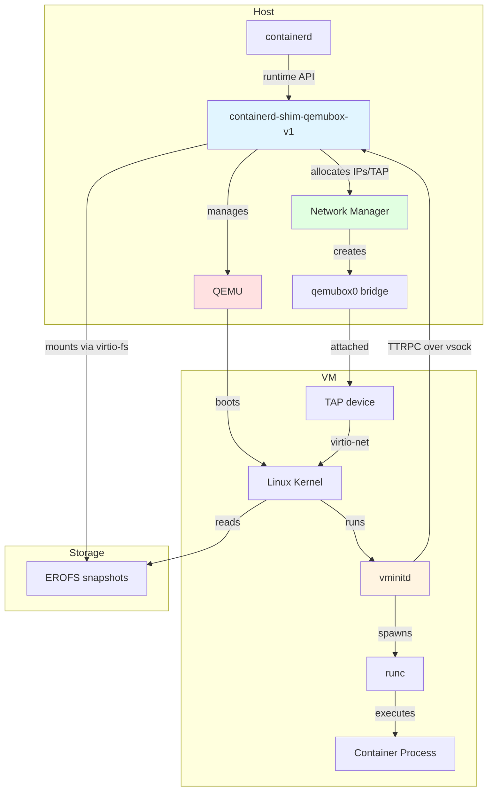
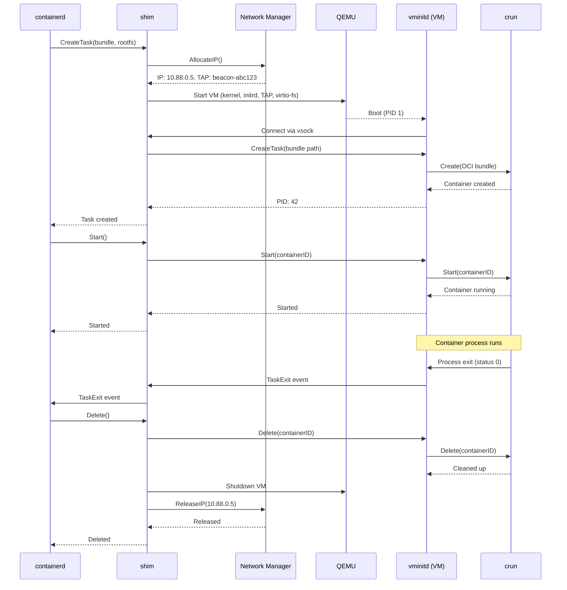

# qemubox: containerd runtime shim with VM isolation

___(Experimental)___ qemubox (contaiNERD sandBOX) is a containerd runtime shim which
isolates container processes using lightweight virtual machines. It is designed for running
Linux containers with enhanced security and isolation.

 - **Linux only** - Requires Linux host with KVM support
 - Works with containerd running on native host
 - EROFS support for efficient container image layers
 - One VM per container for maximum isolation
 - Simplified architecture using QEMU
 - CNI-based networking for standard container networking with IPAM plugin support

qemubox is a **non-core** sub-project of containerd.

## Architecture



### How it works

1. **Container Creation**: When containerd creates a container with the qemubox runtime, it spawns the `containerd-shim-qemubox-v1` shim process
2. **VM Setup**: The shim creates a QEMU VM instance with:
   - Linux kernel and initrd (containing vminitd)
   - EROFS container image layers mounted via virtio-fs
   - TAP network device connected to the qemubox0 bridge
3. **Network Allocation**: The network manager allocates an IP address from the 10.88.0.0/16 subnet and creates a TAP device
4. **VM Boot**: QEMU boots the Linux kernel with the allocated network configuration
5. **Container Execution**: Inside the VM, vminitd communicates with the shim via vsock and uses crun (OCI runtime) to execute the container process
6. **I/O & Events**: Container stdio and lifecycle events flow through vsock between vminitd and the shim

### Component Details

#### Host Components

**containerd-shim-qemubox-v1**
- Implements containerd's runtime shim API
- Manages QEMU VM lifecycle (create, start, stop, delete)
- Handles network setup via integrated network manager
- Proxies container I/O between containerd and VM (via vsock)
- Coordinates with vminitd inside VM using TTRPC protocol

**Network Manager**
- **CNI-based networking**: Executes standard CNI plugin chains (bridge, firewall, tc-redirect-tap, IPAM)
- Manages the `qemubox0` bridge (10.88.0.0/16 subnet) via CNI bridge plugin
- Allocates unique IP addresses using CNI IPAM plugins (host-local, static, or dhcp)
- Creates TAP devices for each VM via CNI plugins (tc-redirect-tap for Firecracker compatibility)
- Configures firewall rules via CNI firewall plugin (iptables/nftables)
- Stores network configuration metadata in `/var/lib/qemubox/cni-config.db` (BoltDB)
- IP allocation state managed by CNI IPAM in `/var/lib/cni/networks/`
- Automatically reconciles and cleans up stale resources
- See `docs/CNI_SETUP.md` for CNI configuration guide

**QEMU**
- KVM-based virtual machine monitor (microvm machine type)
- Boots Linux kernel with minimal memory footprint
- Provides virtio devices: virtio-net (TAP), virtio-fs (storage), vsock (communication)
- Runs as subprocess managed by the shim

#### VM Components

**vminitd**
- Init daemon (PID 1) running inside the VM
- Implements containerd's Task API via TTRPC over vsock
- Manages container lifecycle using crun (OCI runtime)
- Handles stdio forwarding between crun and shim
- Process reaper for container exit status collection
- Supports exec, pause/resume, and checkpoint/restore operations

**crun**
- Standard OCI runtime (lightweight alternative to runc)
- **Primary role**: Enforces cgroups v2 resource limits within the VM
- Creates process namespaces (PID, mount, IPC, UTS) - network namespace explicitly removed
- Sets process UID/GID and drops Linux capabilities
- Exits after container starts (minimal runtime overhead)
- **Resource enforcement**: VM sizing is derived from the OCI spec (defaults 1 vCPU/512MiB); crun applies container-specific limits within those bounds

**Linux Kernel**
- Minimal kernel with virtio drivers and cgroups v2 support
- Mounts container rootfs from virtio-fs shares
- Network configured via kernel command line parameters
- Provides process isolation and resource management

#### Storage Layer

**EROFS Snapshots**
- Read-only filesystem optimized for container images
- Image layers mounted on host and shared to VM via virtio-fs
- Eliminates need for image unpacking inside VM
- Supports efficient layer sharing across containers

**virtio-fs**
- High-performance filesystem sharing between host and VM
- DAX (Direct Access) mode for minimal overhead
- Shared memory region for fast I/O
- Read-only mounts for security

#### Communication

**vsock (virtio-socket)**
- Socket communication between host and VM
- Uses CID (Context ID) addressing instead of IP
- TTRPC protocol for structured RPC calls
- Multiplexed for both control plane (API) and data plane (stdio)

### Design Decisions

**Why QEMU?**
- Widely supported KVM VMM with mature tooling
- Microvm machine type for fast, minimal boot
- Strong virtio device support (virtio-fs, vsock, virtio-net)
- Good observability via QMP and standard debugging tools
- Broad distro packaging and deployment options

**Why crun inside the VM?**
- **Resource limits**: Enforces memory/CPU limits via cgroups v2 within the VM
- **Process isolation**: Creates additional namespace layers (PID, mount, IPC, UTS)
- **OCI compatibility**: Maintains standard OCI spec contract with containerd
- **User credentials**: Sets process UID/GID and drops capabilities per spec
- Minimal overhead (~1.5MB binary, exits after container start)
- Note: VM provides primary isolation; crun adds resource accounting and fine-grained limits

**Why EROFS?**
- Read-only filesystem eliminates security concerns
- Compressed images reduce storage and I/O
- Direct mounting via virtio-fs (no unpacking needed)
- Excellent random access performance
- Native Linux kernel support

**Why vsock?**
- Purpose-built for host-VM communication
- No network stack overhead
- Automatic connection on VM boot
- Secure by design (isolated from network)
- Low latency for RPC and stdio streaming

**Why TAP/bridge networking?**
- Standard Linux networking model
- **CNI plugin compatibility**: Supports standard CNI plugins (Calico, Cilium, tc-redirect-tap, etc.)
- Full protocol support (TCP, UDP, ICMP, IPv6)
- Easy integration with host firewall rules via CNI firewall plugin
- Flexible IPAM options (host-local, static, dhcp)

### Network Architecture

qemubox uses CNI (Container Network Interface) for all networking, integrating with the standard CNI plugin ecosystem:

```
Internet
    ↓
Host network interface
    ↓
CNI Firewall Plugin (iptables/nftables)
    ↓
qemubox0 bridge (CNI-managed, 10.88.0.1/16)
    ├─ tapXXX (CNI tc-redirect-tap) → VM 1 (10.88.0.2)
    ├─ tapYYY (CNI tc-redirect-tap) → VM 2 (10.88.0.3)
    └─ tapZZZ (CNI tc-redirect-tap) → VM 3 (10.88.0.4)
```

**IP Allocation:**
- Bridge gateway: 10.88.0.1
- Container IPs: 10.88.0.2 - 10.88.255.254 (65,533 addresses)
- Managed by CNI IPAM plugins (host-local, static, or dhcp)
- Network configuration metadata stored in `/var/lib/qemubox/cni-config.db` (BoltDB)
- IP allocation state stored in `/var/lib/cni/networks/<network-name>/`
- Automatic lease cleanup on container deletion

**Features:**
- Standard CNI plugin support (bridge, macvlan, ipvlan, Calico, Cilium, etc.)
- Multiple networks per deployment
- Advanced IPAM (host-local, static, dhcp, cloud-provider-specific)
- Network policies via Calico/Cilium
- Firecracker-compatible via tc-redirect-tap plugin
- Custom routing and overlay networks

**CNI Configuration:**

Set environment variables to customize (all optional, defaults shown):

```bash
export QEMUBOX_CNI_CONF_DIR=/etc/cni/net.d     # CNI config directory
export QEMUBOX_CNI_BIN_DIR=/opt/cni/bin        # CNI plugin binaries
export QEMUBOX_CNI_NETWORK=qemubox-net          # CNI network name

# Restart containerd
systemctl restart beacon-containerd
```

**Setup:**

1. Install CNI plugins:
```bash
mkdir -p /opt/cni/bin /etc/cni/net.d
wget https://github.com/containernetworking/plugins/releases/download/v1.4.0/cni-plugins-linux-amd64-v1.4.0.tgz
tar -xzf cni-plugins-linux-amd64-v1.4.0.tgz -C /opt/cni/bin
```

2. Install tc-redirect-tap for Firecracker pattern:
```bash
git clone https://github.com/firecracker-microvm/firecracker-go-sdk
cd firecracker-go-sdk/cni/tc-redirect-tap
go build -o /opt/cni/bin/tc-redirect-tap
```

3. Create CNI configuration `/etc/cni/net.d/10-qemubox.conflist`:
```json
{
  "cniVersion": "1.0.0",
  "name": "qemubox-net",
  "plugins": [
    {
      "type": "bridge",
      "bridge": "qemubox0",
      "isGateway": true,
      "ipMasq": true,
      "ipam": {
        "type": "host-local",
        "ranges": [[{"subnet": "10.88.0.0/16", "gateway": "10.88.0.1"}]],
        "routes": [{"dst": "0.0.0.0/0"}]
      }
    },
    {"type": "firewall"},
    {"type": "tc-redirect-tap"}
  ]
}
```

**Documentation:**
- Comprehensive setup guide: `docs/CNI_SETUP.md`
- Example configurations: `examples/cni/`
- Architecture details: See CLAUDE.md

### Container Lifecycle Sequence



### Security Model

qemubox provides defense-in-depth with multiple isolation layers:

**Layer 1: Hypervisor Isolation (Primary)**
- Each container runs in its own KVM virtual machine
- Hardware-assisted virtualization (Intel VT-x / AMD-V)
- Separate kernel address space per container
- VM escape required to compromise host
- QEMU runs with minimal privileges

**Layer 2: Network Isolation**
- VMs communicate via isolated TAP devices
- Bridge provides L2 isolation between VMs
- nftables rules enforce network policies
- No direct host network access
- NAT for internet connectivity

**Layer 3: Filesystem Isolation**
- EROFS snapshots mounted read-only via virtio-fs
- No shared writable filesystems between host and VM
- Container rootfs modifications stay within VM
- virtio-fs DAX prevents unauthorized host access

**Layer 4: OCI Runtime (Resource Management)**
- crun enforces cgroups v2 resource limits within the VM
- Prevents resource exhaustion: container cannot exceed memory/CPU limits
- Additional process namespaces (PID, mount, IPC, UTS)
- Note: Network namespace explicitly removed - containers share VM's eth0
- Capability dropping and UID/GID enforcement per OCI spec

**Layer 5: Communication Isolation**
- vsock provides isolated communication channel
- No network-based communication between shim and vminitd
- TTRPC protocol with structured messages
- No shell access or command injection vectors

**Attack Surface Reduction:**
- No SSH or remote access in VM
- Minimal kernel configuration
- No unnecessary services in initrd
- crun exits after container start (not persistent)
- Host containerd never executes container code

## VMM Backend

qemubox uses [QEMU](https://www.qemu.org/) as its virtual machine monitor. Features:

- KVM-based virtualization
- QEMU microvm machine type for fast boot
- virtio-fs for efficient filesystem sharing
- vsock for host-VM communication
- TAP device networking with bridge integration
- Full IPv4/IPv6 and ICMP support

### Resource Management Model

**Two-Level Resource Enforcement:**

1. **VM Level (QEMU)** - VM sizing is derived from the OCI spec in `shim/task/service.go`:
   ```
   - Defaults: 1 vCPU, 512MiB memory
   - MaxCPUs scales to host CPUs unless an explicit CPU limit is set
   - Memory hotplug scales to host memory unless an explicit memory limit is set
   ```
   The VM is configured once at boot based on these values.

2. **Container Level (crun + cgroups v2)** - Within VM boundaries:
   - Container requests 100MB memory → crun creates cgroup with 100MB limit (within VM memory)
   - Container requests 0.5 CPU → crun creates cgroup with 50% CPU share (within VM CPUs)
   - Container requests 8GB memory → VM sizing follows the request (aligned to 128MB, capped by host)

**Key Implications:**
- **Memory overhead**: Defaults to 512MiB per VM, aligned to 128MB
- **CPU scheduling**: Defaults to 1 vCPU per VM, MaxCPUs scales with host or explicit limits
- **Network namespace**: Explicitly removed from OCI spec - all containers share VM's `eth0`
- **Resource isolation**: Cgroups prevent containers from exceeding their limits within the VM
- **Overcommit not possible**: Cannot pack multiple small containers in one VM currently

**Code References:**
- VM resources: `shim/task/service.go`, `vm/qemu/qemu.go`
- Network namespace removal: `shim/task/service.go`
- Cgroups requirement: `vminit/task/service.go`

### Performance Characteristics

**Container Startup Time:**
- VM boot: Varies with kernel size and QEMU initialization
- Network setup: ~5-10ms (IP allocation + TAP device creation)
- vminitd initialization: ~10-20ms
- crun container creation: ~5-10ms
- **Total typical startup**: Dominated by VM boot time

**Resource Overhead per Container:**
- Memory: Defaults to **512MiB per VM**, aligned to 128MB; hotplug can expand based on limits
- CPU: Defaults to **1 vCPU per VM**, MaxCPUs scales with host or explicit limits
- Disk: Kernel (~10-15MB) + initrd (~5-10MB) per VM
- Network: One TAP device per container (~0.1ms latency)
- **Important**: VM resources are fixed regardless of container spec requests

**Scalability:**
- Maximum containers: Limited by available IP addresses (65,533) and system resources
- Network bandwidth: Full host network bandwidth available via TAP/bridge
- I/O performance: virtio-fs with DAX provides near-native filesystem performance
- Memory deduplication: Kernel Samepage Merging (KSM) can deduplicate identical VM pages

**Comparison with Native Containers:**
- Startup: Slower (VM boot overhead)
- Runtime: Comparable for CPU-bound workloads
- I/O: Slightly slower due to virtio-fs layer
- Network: Comparable with TAP/bridge networking
- **Trade-off**: Enhanced isolation for modest performance cost

### Troubleshooting

**Check VM networking:**

```bash
# Check if CNI mode is active
journalctl -u beacon-containerd | grep -i cni

# Verify CNI configuration
ls /etc/cni/net.d/
cat /etc/cni/net.d/10-qemubox.conflist | jq .

# Check CNI plugins
ls -la /opt/cni/bin/

# Check CNI IPAM state
ls -la /var/lib/cni/networks/qemubox-net/

# Check TAP devices (if using tc-redirect-tap)
ip link show | grep -E "tap|beacon"
```

**Debug container creation:**
```bash
# Enable debug logging in containerd
containerd --log-level debug

# Check binaries are installed
ls -la /usr/share/qemubox/kernel/qemubox-kernel-x86_64
ls -la /usr/share/qemubox/kernel/qemubox-initrd
ls -la /usr/share/qemubox/bin/qemu-system-x86_64

# Verify KVM access
ls -la /dev/kvm
```

**Monitor vsock communication:**
```bash
# Check for vsock connections (requires root)
ss -x | grep vsock
```

**Common issues:**

1. **"qemu-system-x86_64 binary not found at /usr/share/qemubox/bin/qemu-system-x86_64"**
   - Install QEMU to `/usr/share/qemubox/bin/qemu-system-x86_64`
   - Or set `QEMUBOX_QEMU_PATH` to override the location

2. **"kernel not found at /usr/share/qemubox/kernel/qemubox-kernel-x86_64"**
   - Install the kernel to `/usr/share/qemubox/kernel/qemubox-kernel-x86_64`
   - Or use `QEMUBOX_SHARE_DIR` environment variable to override the location

3. **"Permission denied on /dev/kvm"**
   - Add user to `kvm` group: `sudo usermod -aG kvm $USER`

4. **"Network device qemubox0 not found"**
   - Network manager creates bridge on first container
   - Check logs for initialization errors

5. **"IP allocation failed"**
   - Check CNI IPAM state: `ls /var/lib/cni/networks/qemubox-net/`; clear stale allocations: `sudo rm -rf /var/lib/cni/networks/qemubox-net/*`

6. **"CNI plugin not found"** (CNI mode only)
   - Install CNI plugins: See CNI Mode setup section above
   - Verify `QEMUBOX_CNI_BIN_DIR` points to `/opt/cni/bin`
   - Check permissions: `sudo chmod +x /opt/cni/bin/*`

7. **"No TAP device found in CNI result"** (CNI mode only)
   - Install tc-redirect-tap plugin: See CNI Mode setup section above
   - Add `{"type": "tc-redirect-tap"}` to CNI configuration plugins array
   - See `docs/CNI_SETUP.md` for detailed troubleshooting

## Getting Started

### Prerequisites

Building requires:
- Go 1.23+
- Docker with buildx installed
- Task runner (https://taskfile.dev) - `go install github.com/go-task/task/v3/cmd/task@latest`

### First-time Setup

Install all required development tools (protoc, protobuf generators, etc.):

```bash
task setup
```

This will install:
- Protocol buffer compiler (protoc)
- Go protobuf code generators (protoc-gen-go, protoc-gen-go-ttrpc)
- Protobuild tool and utilities

If you see warnings about `/usr/local/include`, run the suggested sudo commands to complete the setup.

### Building

Build the shim, kernel, and initrd:

```bash
task build
```

The results will be in the `_output` directory:
- `containerd-shim-qemubox-v1` - The runtime shim
- `qemubox-kernel-x86_64` - Linux kernel for the VM
- `qemubox-initrd` - Initial ramdisk containing vminitd

### Installation Paths

beacon uses the following standardized paths - these are **not** searched, they must exist at these exact locations:

- **Binaries and config**: `/usr/share/qemubox/`
  - `/usr/share/qemubox/bin/` - Executable binaries
    - `containerd`, `ctr`, `runc` - Container runtime components
    - `nerdctl` - Docker-compatible CLI
    - `buildkitd`, `buildctl` - BuildKit components
    - `qemu-system-x86_64`, `qemu-img` - QEMU VM binaries
    - `containerd-shim-qemubox-v1` - Beacon runtime shim
  - `/usr/share/qemubox/kernel/` - Kernel files
    - `qemubox-kernel-x86_64` - VM kernel
    - `qemubox-initrd` - Initial ramdisk
  - `/usr/share/qemubox/libexec/cni/` - CNI plugins
  - `/usr/share/qemubox/config/` - Configuration files
  - `/usr/share/qemubox/systemd/` - Systemd service files

- **State files**: `/var/lib/qemubox/`
  - `/var/lib/qemubox/network.db` - Network allocation database
  - `/var/lib/qemubox/containerd/` - containerd state
  - Per-container state directories under `/var/lib/qemubox/`

- **Logs**: `/var/log/qemubox/`
  - VM and container logs

These paths can be overridden using environment variables:
- `QEMUBOX_SHARE_DIR` - Override `/usr/share/qemubox`
- `QEMUBOX_STATE_DIR` - Override `/var/lib/qemubox`
- `QEMUBOX_LOG_DIR` - Override `/var/log/qemubox`

**Note**: Binaries are not searched for in `$PATH` or other locations. They must be installed at the exact paths shown above.

### Runtime Prerequisites

- Linux host with KVM support (`/dev/kvm` accessible)
- containerd 1.7 or later
- All beacon components installed at the paths listed above (use the release tarball and run `install.sh`)
- erofs-utils for EROFS snapshot support

### Configuring containerd

The default containerd configuration should work for most cases. EROFS snapshots are mounted on the host and passed to the VM via virtio-fs.

<details>
<summary>Optional EROFS configuration</summary>

If you want to use EROFS snapshots (recommended for better performance), configure containerd:

```bash
containerd config default > config.toml
```

Add EROFS snapshotter configuration:

```toml
  [plugins.'io.containerd.snapshotter.v1.erofs']
    default_size = "64M"
```

</details>

### Running

Run containerd with the shim and qemubox components in the PATH:

```bash
PATH=$(pwd)/_output:$PATH containerd
```

Pull a container image:

```bash
ctr image pull --snapshotter erofs docker.io/library/alpine:latest
```

Start a container with the qemubox runtime:

```bash
ctr run -t --rm --snapshotter erofs --runtime io.containerd.qemubox.v1 \
  docker.io/library/alpine:latest test /bin/sh
```

### Installing QEMU

Install QEMU to the beacon share directory or use the system package:

```bash
# Option 1: use the system package
sudo apt-get install -y qemu-system-x86

# Option 2: copy the built artifacts from `task build:qemu`
sudo mkdir -p /usr/share/qemubox/bin
sudo cp _output/bin/qemu-system-x86_64 /usr/share/qemubox/bin/
sudo cp _output/bin/qemu-img /usr/share/qemubox/bin/
```

### Current Limitations

**Platform Support:**
- Linux only (requires KVM)
- x86_64 architecture (arm64 support possible but not tested)
- No macOS or Windows support (no nested virtualization)

**Networking:**
- Opt-in support for standard CNI plugins (see docs/CNI_SETUP.md)
- No IPv6-only mode
- Requires host NAT configuration for internet access (or CNI plugin-managed routing)

**Resource Management:**
- One VM per container (cannot share VMs between containers)
- No VM pooling or pre-warming (cold start for each container)
- No live migration or VM checkpoint/restore at shim level
- Fixed VM resources at startup

**Storage:**
- EROFS recommended but not required
- No volume sharing between containers
- Read-only image layers only (no writable layer sharing)

**Compatibility:**
- Requires cgroups v2 (unified hierarchy)
- containerd 1.7+ recommended
- No support for Docker API directly (use containerd)

## How does this compare with other projects?

### VM-based container runtimes

 - **Kata Containers** - Mature containerd runtime with VM isolation supporting multiple hypervisors. qemubox is similar in approach but focuses on simplicity with a single VMM backend (QEMU) and tight integration with modern containerd features like EROFS.

 - **gVisor** - Provides container isolation using a user-space kernel. More lightweight than qemubox but with different security trade-offs and compatibility considerations.

### Comparison with Lima/Docker Desktop

 - **Lima** and **Docker Desktop** run a single VM containing the entire container runtime (containerd/dockerd), with the API exposed to the host.

 - **qemubox** runs containerd natively on the host, with each container getting its own dedicated VM for maximum isolation. This provides better security boundaries between containers.

### Why qemubox?

**Simplicity:**
- Uses standard upstream components (QEMU, crun, containerd)
- No custom patches or forks
- Straightforward architecture with clear separation of concerns
- Easy to understand and debug

**Modern Integration:**
- Built for EROFS from the ground up
- Native cgroups v2 support
- Designed for containerd's sandbox API
- Leverages latest kernel features (virtio-fs, vsock)

**Security Focus:**
- VM isolation as primary boundary
- Minimal attack surface in VM
- No persistent services in container VM
- Read-only image layers
- Isolated network and storage

## Key Technologies

- [**QEMU**](https://www.qemu.org/) - Mature, widely supported KVM-based VMM
- [**EROFS**](https://erofs.docs.kernel.org/) - Efficient read-only filesystem for container images
- [**containerd**](https://github.com/containerd/containerd) - Industry-standard container runtime
- [**vsock**](https://wiki.qemu.org/Features/VirtioVsock) - Efficient host-VM communication channel
