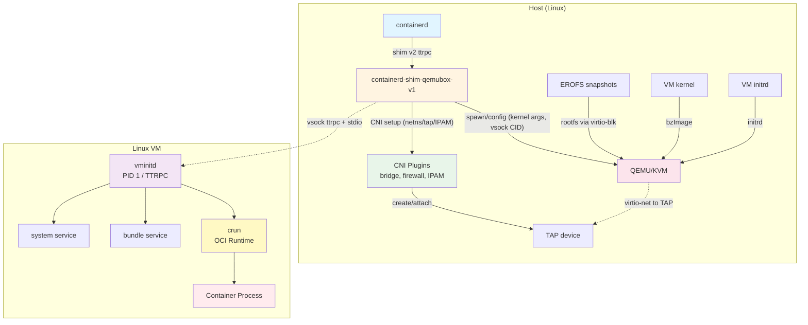

# qemubox

**Experimental** containerd runtime that runs each container in its own lightweight VM using QEMU/KVM.

- Linux only (requires KVM)
- One VM per container for strong isolation
- Standard CNI networking
- EROFS snapshots for efficient storage

## Why?

VM isolation provides a stronger security boundary than namespace-based containers, while maintaining compatibility with standard containerd tooling.

## Architecture



Legend:
- Solid arrows: control plane (lifecycle, config, setup)
- Dotted arrows: data plane (vsock I/O, virtio)

**Key components:**
- **Shim**: Manages VM lifecycle and proxies I/O via vsock
- **CNI**: Standard CNI plugin chains for networking (auto-discovers config)
- **QEMU**: Boots lightweight VMs with virtio devices
- **vminitd**: Init daemon inside VM that runs crun to start containers

## Repository Layout

- `cmd/`: entrypoints for shim and guest init binaries
- `internal/host/`: host-side VM, network, storage, and mount plumbing
- `internal/shim/`: containerd shim implementation and task service
- `internal/guest/`: vminitd logic, guest services, and stream handling
- `internal/config/`: configuration management
- `internal/paths/`: path resolution helpers
- `api/`: protobuf/TTRPC definitions and generated stubs
- `assets/`: kernel config, example configs, and other build-time inputs

## Quick Start

### Prerequisites

- Linux with KVM (`/dev/kvm` accessible)
- containerd 1.7+
- Standard CNI plugins
- QEMU (system package or build from source)

### Install CNI Plugins

```bash
# Install standard CNI plugins
sudo mkdir -p /opt/cni/bin /etc/cni/net.d
wget https://github.com/containernetworking/plugins/releases/download/v1.4.0/cni-plugins-linux-amd64-v1.4.0.tgz
sudo tar -xzf cni-plugins-linux-amd64-v1.4.0.tgz -C /opt/cni/bin

# Install tc-redirect-tap (for TAP device support)
git clone https://github.com/firecracker-microvm/firecracker-go-sdk
cd firecracker-go-sdk/cni/tc-redirect-tap
go build -o tc-redirect-tap
sudo mv tc-redirect-tap /opt/cni/bin/
sudo chmod +x /opt/cni/bin/*
```

### Create CNI Configuration

Create `/etc/cni/net.d/10-qemubox.conflist`:

```json
{
  "cniVersion": "1.0.0",
  "name": "qemubox-net",
  "plugins": [
    {
      "type": "bridge",
      "bridge": "qemubox0",
      "isGateway": true,
      "ipMasq": true,
      "ipam": {
        "type": "host-local",
        "ranges": [[{"subnet": "10.88.0.0/16", "gateway": "10.88.0.1"}]],
        "routes": [{"dst": "0.0.0.0/0"}]
      }
    },
    {"type": "firewall"},
    {"type": "tc-redirect-tap"}
  ]
}
```

### Build

```bash
# Install Task runner
go install github.com/go-task/task/v3/cmd/task@latest

# Setup development tools
task setup

# Build everything
task build
```

This creates:
- `_output/containerd-shim-qemubox-v1` - Runtime shim
- `_output/qemubox-kernel-x86_64` - VM kernel
- `_output/qemubox-initrd` - Initial ramdisk

### Install

```bash
# Install to standard paths
sudo mkdir -p /usr/share/qemubox/bin /usr/share/qemubox/kernel
sudo cp _output/containerd-shim-qemubox-v1 /usr/share/qemubox/bin/
sudo cp _output/qemubox-kernel-x86_64 /usr/share/qemubox/kernel/
sudo cp _output/qemubox-initrd /usr/share/qemubox/kernel/

# Install QEMU (option 1: system package)
sudo apt-get install -y qemu-system-x86

# Or (option 2: copy to qemubox directory)
sudo cp /usr/bin/qemu-system-x86_64 /usr/share/qemubox/bin/
```

### Configure containerd

Register the runtime in `/etc/containerd/config.toml`:

```toml
[plugins."io.containerd.grpc.v1.cri".containerd.runtimes.qemubox]
  runtime_type = "io.containerd.qemubox.v1"
```

Restart containerd:
```bash
sudo systemctl restart containerd
```

### Run a Container

```bash
# Pull an image
sudo ctr image pull --snapshotter erofs docker.io/library/alpine:latest

# Run with qemubox runtime
sudo ctr run -t --rm \
  --snapshotter erofs \
  --runtime io.containerd.qemubox.v1 \
  docker.io/library/alpine:latest \
  test /bin/sh
```

## How It Works

1. **containerd** calls the qemubox shim to create a container
2. **CNI** allocates an IP and creates a TAP device (auto-discovers config from `/etc/cni/net.d/`)
3. **QEMU** boots a microVM with kernel, network, and storage
4. **vminitd** (PID 1 in VM) connects to shim via vsock
5. **crun** starts the container process with resource limits
6. Container I/O flows through vsock to containerd

## Networking

Qemubox uses standard CNI for all networking:

- **Config directory**: `/etc/cni/net.d/` (auto-discovers first `.conflist` file)
- **Plugin binaries**: `/opt/cni/bin/`
- **Supported plugins**: bridge, firewall, IPAM (host-local, static, dhcp), tc-redirect-tap

You can use any CNI configuration - qemubox has no hardcoded network requirements.

## Storage

Uses EROFS snapshots for efficient, read-only container images:
- EROFS images exposed to VM as virtio-blk block devices
- No unpacking inside VM
- Efficient read-only filesystem with inline compression

## Resource Management

Two levels of enforcement:

1. **VM level**: QEMU allocates vCPUs and memory (default: 1 vCPU, 512 MiB)
   - Dynamic CPU hotplug scales vCPUs based on usage (up to maxcpus)
   - Memory limits set at VM creation
2. **Container level**: crun enforces cgroups v2 limits within the VM

VM resources are derived from the OCI spec but default conservatively. Container limits are enforced within those bounds.

## Security

Multiple isolation layers:

- **VM boundary**: Hardware virtualization (KVM) isolates each container
- **Network**: Isolated TAP devices, firewall rules via CNI
- **Storage**: Read-only EROFS via virtio-blk
- **Resource**: cgroups v2 prevents resource exhaustion
- **Communication**: vsock (no network-based IPC)

## Troubleshooting

**Check CNI configuration:**
```bash
ls /etc/cni/net.d/
cat /etc/cni/net.d/10-qemubox.conflist | jq .
ls -la /opt/cni/bin/
```

**Verify installation:**
```bash
ls -la /usr/share/qemubox/kernel/qemubox-kernel-x86_64
ls -la /usr/share/qemubox/kernel/qemubox-initrd
which qemu-system-x86_64
ls -la /dev/kvm
```

**Common issues:**

- **"Permission denied on /dev/kvm"**: Add user to `kvm` group: `sudo usermod -aG kvm $USER`
- **"CNI plugin not found"**: Install CNI plugins to `/opt/cni/bin/` (see setup above)
- **"No TAP device found"**: Install tc-redirect-tap plugin (see setup above)
- **"Network device not found"**: CNI bridge plugin creates bridge based on config - check logs

**Enable debug logs:**
```bash
export QEMUBOX_SHIM_DEBUG=true
sudo systemctl restart containerd
journalctl -u containerd -f
```

## Comparison with Other Projects

- **Kata Containers**: Similar VM-per-container approach but more complex with multiple VMM backends. Qemubox is simpler with QEMU-only support.
- **gVisor**: User-space kernel provides isolation without VMs. Different security trade-offs and compatibility.
- **Lima/Docker Desktop**: Run entire container runtime in a single VM. Qemubox gives each container its own VM for stronger isolation.

## Limitations

- Linux only (KVM required)
- x86_64 only (arm64 untested)
- One VM per container (no sharing)
- Cold start for each container (no VM pooling)

## Documentation

- **Architecture details**: See `CLAUDE.md`
- **Configuration reference**: See `docs/CONFIGURATION.md`
- **Example configs**: See `assets/examples/cni/`

## License

Apache 2.0

## Contributing

This is an experimental project. Issues and pull requests welcome!
