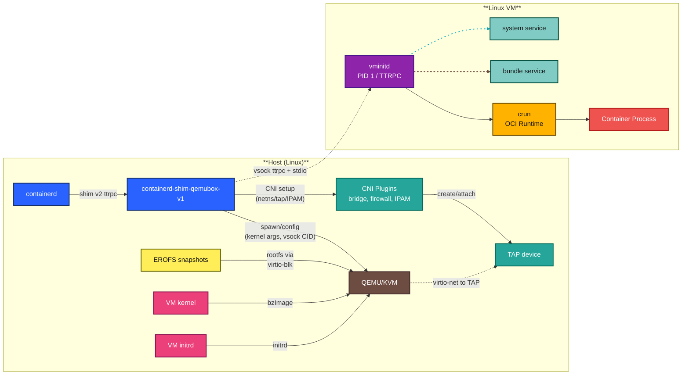
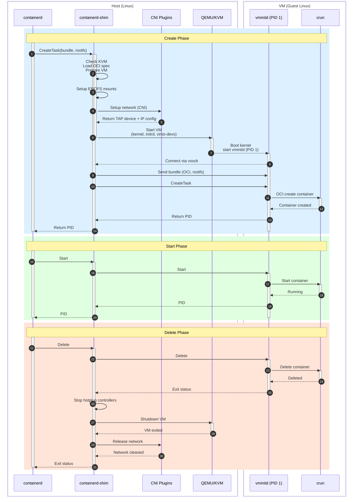

<div align="center">

# qemubox

**Lightweight VM isolation for containers**

[](https://github.com/aledbf/qemubox/actions/workflows/ci.yml)
[](https://codecov.io/gh/aledbf/qemubox)
[](LICENSE)

*Run each container in its own lightweight QEMU/KVM virtual machine*

[Quick Start](#quick-start) • [Demos](#demos) • [Architecture](#architecture) • [Documentation](#documentation)

</div>

---

> **TL;DR**: Experimental containerd runtime providing VM-level isolation with ~300ms boot times.
> Get the security of VMs with the UX of containers.

## Features

- ✅ **Strong isolation** — One VM per container via KVM hardware virtualization
- ✅ **Fast boot** — ~300ms with optimized kernel and systemd
- ✅ **Standard networking** — CNI plugin compatible (Calico, Cilium, etc.)
- ✅ **Efficient storage** — EROFS snapshots with inline compression
- ✅ **Snapshot & commit** — Persist VM state like Docker images
- ✅ **containerd native** — Works with existing tooling (ctr, nerdctl, crictl)

## Table of Contents

- [Demos](#demos)
- [Design Choices](#design-choices)
- [Quick Start](#quick-start)
- [Architecture](#architecture)
- [Security](#security)
- [Comparison](#comparison)
- [Development](#development)
- [Roadmap](#roadmap)

## Demos

### Boot & Docker-in-VM
[](https://asciinema.org/a/5GJ0fPswxolRL4kiUQTpry6au)

Launch a full Ubuntu VM with Docker pre-installed. Shows ~300ms boot time with systemd, running containers inside the isolated VM - nested virtualization without the overhead.

### Snapshot & Commit
[](https://asciinema.org/a/aIk4RocQFPk7I0QizhRwULKLz)

Persist disk state between VM runs: install packages, create files, then commit to a new image with `nerdctl commit`. The next VM boots with all changes preserved - like Docker commits, but for entire VMs.

> **Note**: Snapshot support (for EROFS) requires a custom containerd build from [aledbf/containerd@aledbf/erofs-snapshot-narrow](https://github.com/aledbf/containerd/tree/aledbf/erofs-snapshot-narrow) until the changes are upstreamed.

---

## Design Choices

qemubox is inspired by [nerdbox](https://github.com/containerd/nerdbox), which pioneered the "shim-level VM isolation" approach for containerd using [libkrun](https://github.com/containers/libkrun).

**qemubox** takes a different path, optimized for Linux server workloads:

| | nerdbox | qemubox |
|---|---------|---------|
| **VMM** | libkrun (Rust) | QEMU/KVM |
| **Platforms** | Linux, macOS, Windows | Linux only |
| **Focus** | Cross-platform, rootless | Server workloads, KVM features |
| **Networking** | libkrun networking | Standard CNI plugins |

**Why QEMU/KVM?**

1. **QEMU's maturity** - Battle-tested VMM with extensive device support, debugging tools (QMP, gdbstub), and broad kernel compatibility
2. **Standard CNI networking** - Reuse existing CNI plugins (Calico, Cilium, etc.) instead of custom networking
3. **KVM-specific features** - CPU/memory hotplug, vhost-net, virtio-blk, and other Linux-specific optimizations
4. **Simpler deployment** - Single static binary VMM without Rust runtime dependencies

If you need cross-platform support or rootless containers, check out [nerdbox](https://github.com/containerd/nerdbox).

## Why VMs?

VM isolation provides a stronger security boundary than namespace-based containers, while maintaining compatibility with standard containerd tooling.

## Quick Start

### Prerequisites

- Linux with KVM (`/dev/kvm` accessible)

### Install

Download the latest release and run the installer:

```bash
tar xzf qemubox-VERSION-linux-x86_64.tar.gz
cd qemubox-VERSION-linux-x86_64
sudo ./install.sh
```

The release includes everything: containerd, QEMU, kernel, CNI plugins, and configuration.

For systems with existing containerd, use shim-only mode:

```bash
sudo ./install.sh --shim-only
```

See `./install.sh --help` for all options.

### Start

```bash
sudo systemctl enable --now qemubox-containerd
sudo systemctl start --now qemubox-containerd
```

### Run a Container

```bash
# Add qemubox binaries to PATH
export PATH=/usr/share/qemubox/bin:$PATH

# Pull an image
ctr --address /var/run/qemubox/containerd.sock image pull \
  --snapshotter nexus-erofs ghcr.io/aledbf/qemubox/sandbox:v0.0.11

# Run with qemubox runtime
ctr --address /var/run/qemubox/containerd.sock run -t --rm \
  --snapshotter nexus-erofs \
  --runtime io.containerd.qemubox.v1 \
  ghcr.io/aledbf/qemubox/sandbox:v0.0.11 test-qemu-shim
```
(use root:qemubox to log in)

## Architecture

**Key components:**
- **Shim**: Manages VM lifecycle and proxies I/O via vsock
- **CNI**: Standard CNI plugin chains for networking
- **QEMU**: Boots lightweight VMs with virtio devices
- **vminitd**: Init daemon inside VM that runs crun

<details>
<summary>📐 View Architecture Diagram</summary>



</details>

## How It Works

1. **containerd** calls the qemubox shim to create a container
2. **CNI** allocates an IP and creates a TAP device
3. **QEMU** boots a microVM with kernel, network, and storage
4. **vminitd** (PID 1 in VM) connects to shim via vsock
5. **crun** starts the container process with resource limits
6. Container I/O flows through vsock to containerd

<details>
<summary>📊 View Container Lifecycle Sequence Diagram</summary>



</details>

## Security

Multiple isolation layers:

- **VM boundary**: Hardware virtualization (KVM) isolates each container
- **Network**: Isolated TAP devices, firewall rules via CNI
- **Storage**: Read-only EROFS via virtio-blk
- **Resource**: cgroups v2 prevents resource exhaustion
- **Communication**: vsock (no network-based IPC)

## Limitations

- Linux only (KVM required)
- x86_64 only (arm64 untested)
- One VM per container (no sharing)
- Cold start for each container (no VM pooling)

## Development

### Build from Source

```bash
# Install Task runner
go install github.com/go-task/task/v3/cmd/task@latest

# Build everything (requires Docker for kernel/initrd)
task build

# Create release tarball
task release
```

### Repository Layout

```
cmd/           - Entrypoints (shim, vminitd)
internal/      - Implementation
  host/        - VM, network, storage management
  shim/        - Containerd shim implementation
  guest/       - vminitd and guest services
  config/      - Configuration management
api/           - Protobuf/TTRPC definitions
build/         - Build inputs (kernel config)
deploy/        - Installation scripts and configs
examples/      - Example configurations
hack/          - Development scripts
images/        - Container/VM image builds
```

## Comparison

| Project | Approach | Trade-offs |
|---------|----------|------------|
| **qemubox** | VM per container (QEMU/KVM) | Strong isolation, Linux-only, cold start overhead |
| **[nerdbox](https://github.com/containerd/nerdbox)** | VM per container (libkrun) | Cross-platform, rootless, newer VMM |
| **[Kata Containers](https://katacontainers.io/)** | VM per container (multiple VMMs) | Production-ready, more complex |
| **[gVisor](https://gvisor.dev/)** | User-space kernel | No VM overhead, different syscall compatibility |
| **runc** | Namespaces only | Fast, weaker isolation |

## Roadmap

- **Remove KVM requirement**: Support [PVM (Protected Virtual Machine)](https://github.com/virt-pvm/linux) kernel for environments without `/dev/kvm` ([LWN article](https://lwn.net/Articles/963718/))
- **Filesystem merge snapshots**: Leverage containerd's [fsmerge feature](https://github.com/containerd/containerd/pull/12374) for more efficient storage
- **Metrics and tracing**: Add TTRPC tracing to provide detailed observability into VM and container behavior
- **Annotations for features**: Allow enabling/disabling features (CPU/memory hotplug, etc.) via OCI annotations
- ~~**Snapshot demo**: Demonstrate VM snapshots - restart a VM with previous state/changes preserved~~ ✓ [Done](https://asciinema.org/a/aIk4RocQFPk7I0QizhRwULKLz)

## License

Apache 2.0

## Contributing

Experimental project. Issues and PRs welcome.
