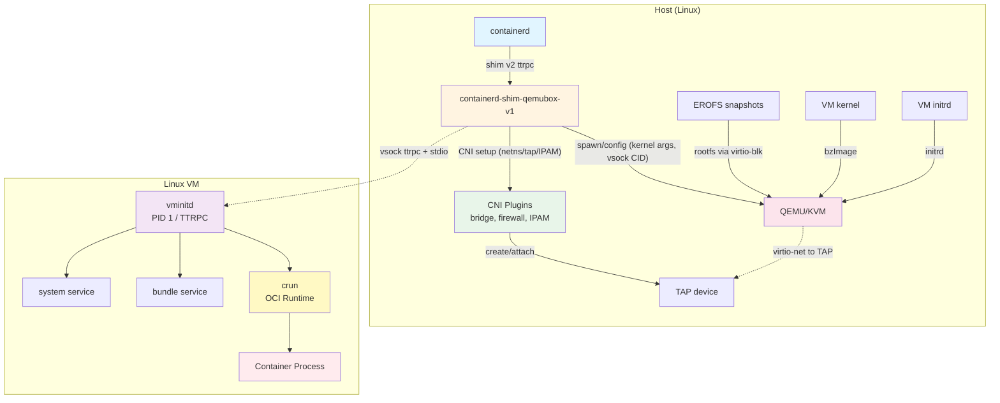

# qemubox

**Experimental** containerd runtime that runs each container in its own lightweight VM using QEMU/KVM.

- Linux only (requires KVM)
- One VM per container for strong isolation
- Standard CNI networking
- EROFS snapshots for efficient storage

## Why?

VM isolation provides a stronger security boundary than namespace-based containers, while maintaining compatibility with standard containerd tooling.

## Quick Start

### Prerequisites

- Linux with KVM (`/dev/kvm` accessible)

### Install

Download the latest release and run the installer:

```bash
tar xzf qemubox-VERSION-linux-x86_64.tar.gz
cd qemubox-VERSION-linux-x86_64
sudo ./install.sh
```

The release includes everything: containerd, QEMU, kernel, CNI plugins, and configuration.

For systems with existing containerd, use shim-only mode:

```bash
sudo ./install.sh --shim-only
```

See `./install.sh --help` for all options.

### Start

```bash
sudo systemctl enable --now qemubox-containerd
```

### Run a Container

```bash
# Add qemubox binaries to PATH
export PATH=/usr/share/qemubox/bin:$PATH

# Pull an image
ctr image pull --snapshotter erofs docker.io/library/alpine:latest

# Run with qemubox runtime
ctr run -t --rm \
  --snapshotter erofs \
  --runtime io.containerd.qemubox.v1 \
  docker.io/library/alpine:latest \
  test /bin/sh
```

## Architecture



**Key components:**
- **Shim**: Manages VM lifecycle and proxies I/O via vsock
- **CNI**: Standard CNI plugin chains for networking
- **QEMU**: Boots lightweight VMs with virtio devices
- **vminitd**: Init daemon inside VM that runs crun

## How It Works

1. **containerd** calls the qemubox shim to create a container
2. **CNI** allocates an IP and creates a TAP device
3. **QEMU** boots a microVM with kernel, network, and storage
4. **vminitd** (PID 1 in VM) connects to shim via vsock
5. **crun** starts the container process with resource limits
6. Container I/O flows through vsock to containerd

## Security

Multiple isolation layers:

- **VM boundary**: Hardware virtualization (KVM) isolates each container
- **Network**: Isolated TAP devices, firewall rules via CNI
- **Storage**: Read-only EROFS via virtio-blk
- **Resource**: cgroups v2 prevents resource exhaustion
- **Communication**: vsock (no network-based IPC)

## Limitations

- Linux only (KVM required)
- x86_64 only (arm64 untested)
- One VM per container (no sharing)
- Cold start for each container (no VM pooling)

## Development

### Build from Source

```bash
# Install Task runner
go install github.com/go-task/task/v3/cmd/task@latest

# Build everything (requires Docker for kernel/initrd)
task build

# Create release tarball
task release
```

### Repository Layout

```
cmd/           - Entrypoints (shim, vminitd)
internal/      - Implementation
  host/        - VM, network, storage management
  shim/        - Containerd shim implementation
  guest/       - vminitd and guest services
  config/      - Configuration management
api/           - Protobuf/TTRPC definitions
build/         - Build inputs (kernel config)
deploy/        - Installation scripts and configs
examples/      - Example configurations
hack/          - Development scripts
images/        - Container/VM image builds
```

## Documentation

- [`CLAUDE.md`](CLAUDE.md) - Architecture and development guide
- [`docs/CONFIGURATION.md`](docs/CONFIGURATION.md) - Configuration reference
- [`deploy/config/`](deploy/config/) - Production configurations
- [`examples/`](examples/) - Example configurations (config.json, CNI)

## Comparison

| Project | Approach | Trade-offs |
|---------|----------|------------|
| **qemubox** | VM per container (QEMU) | Strong isolation, simple, cold start overhead |
| **Kata Containers** | VM per container (multiple VMMs) | Production-ready, more complex |
| **gVisor** | User-space kernel | No VM overhead, different compatibility |
| **runc** | Namespaces only | Fast, weaker isolation |

## License

Apache 2.0

## Contributing

Experimental project. Issues and PRs welcome.
